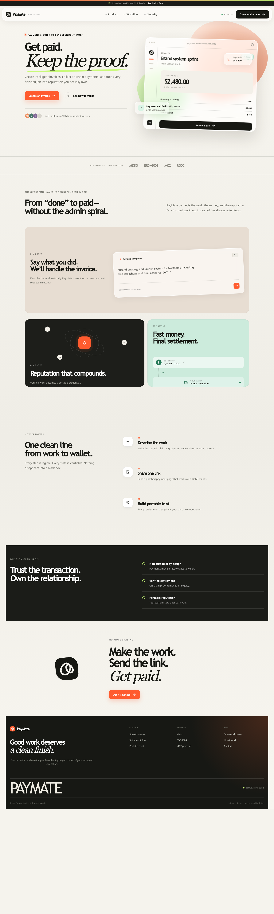
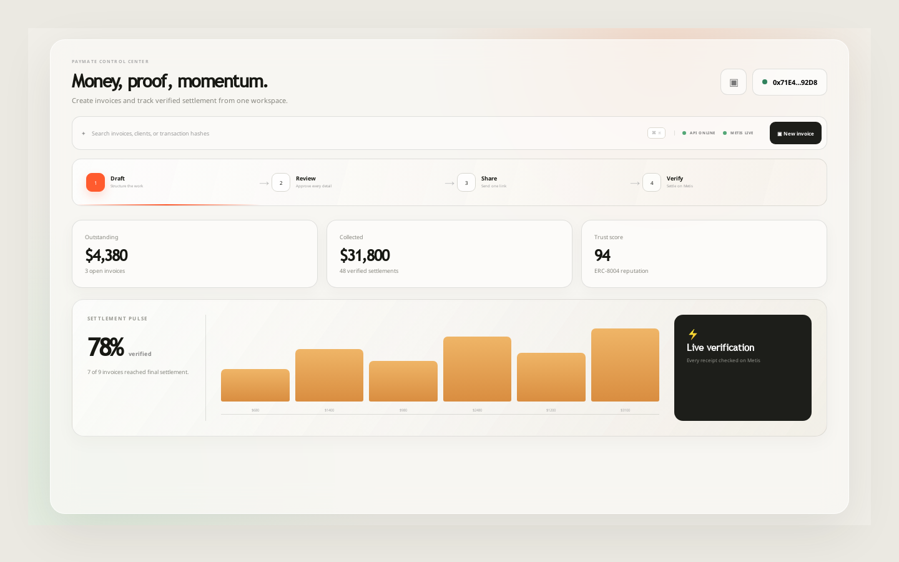
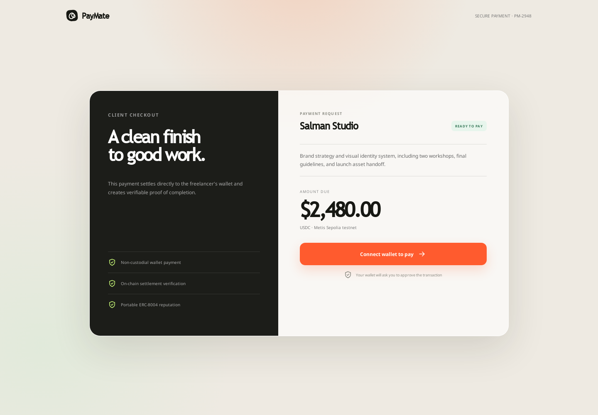
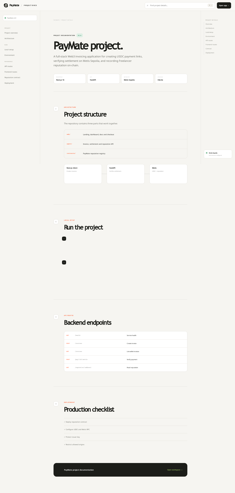
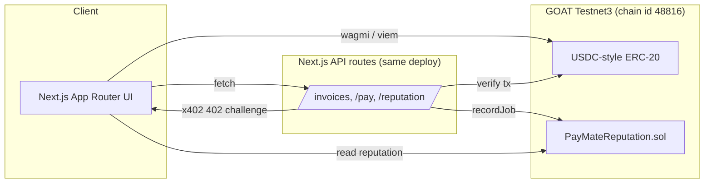

# PayMate

**Money, proof, momentum.** A full-stack Web3 invoicing app for independent
work — send a payment link, get paid in USDC, and build a portable,
on-chain reputation with every settled job.

[](https://paymates.vercel.app)
[](https://explorer.testnet3.goat.network)
[](https://nextjs.org)
[](#license)

**Live app:** [paymates.vercel.app](https://paymates.vercel.app)
· **Docs:** [/docs](https://paymates.vercel.app/docs)
· **Built for:** [GOAT Network Summer Bootcamp 2026](https://github.com/GOATNetwork/GOAT-Hackathon-2026)

---

## Why PayMate

Independent contractors doing crypto-paid work today track invoices in DMs
and spreadsheets, with no proof of who actually delivers. PayMate fixes
both problems in one flow: draft an invoice, share a link, get paid
directly to your wallet, and have every verified settlement recorded
on-chain as a portable reputation credential — no custodian, no platform
lock-in, no fake demo data.

## Features

- **Intelligent invoice drafting** — describe the work in plain language;
  PayMate structures a reviewable draft (AI-assisted, with a deterministic
  no-key fallback so it never blocks on a missing API key)
- **Direct, non-custodial USDC settlement** on GOAT Testnet3, using the
  [x402](https://github.com/GOATNetwork/x402) payment protocol
- **Server-side settlement verification** — checks transaction status,
  token address, recipient, and amount before an invoice is marked paid
- **On-chain reputation** — an [ERC-8004](https://github.com/GOATNetwork/agentkit)-style
  registry records completed jobs and cumulative earnings per wallet
- **Live workspace** — outstanding balance, settlement rate, invoice
  activity, and trust score in one dashboard
- **Zero fake state** — no demo mode, mocked settlement, or simulated
  reputation; every number on screen comes from a real API call or a
  real transaction

## Screenshots

| Landing | Dashboard |
|---|---|
|  |  |

| Checkout | Docs |
|---|---|
|  |  |

## Architecture



There's no separate backend process. `web/` is a single Next.js 16
deployment: the App Router UI *and* the `/api/**` route handlers that draft
invoices, issue x402 payment requirements, verify on-chain settlement, and
read/write reputation.

## Tech stack

| Layer | Choice |
|---|---|
| Frontend | Next.js 16, React 19 |
| Chain access | wagmi 3 + viem 2 (client), viem (server) |
| Backend | Next.js Route Handlers (`web/src/app/api/**`) |
| Storage | Postgres (Neon), via `@neondatabase/serverless` |
| Contracts | Solidity 0.8.24, Hardhat 3 |
| Network | GOAT Testnet3 — chain id `48816`, RPC `rpc.testnet3.goat.network` |
| Payments | x402 protocol, direct ERC-20 transfer |
| Reputation | ERC-8004-style on-chain registry |
| Deployment | Vercel, Git-connected for auto-deploy on push |

## Quick start

```bash
cd web
npm install
cp .env.example .env.local   # fill in the values below
npm run dev
```

Visit `http://localhost:3000`. The frontend and API share one dev server —
there's nothing else to start.

### Environment variables (`web/.env.local`)

| Variable | Purpose |
|---|---|
| `OPENAI_API_KEY` | Optional — enables AI-structured drafting (a deterministic parser is used when blank) |
| `RPC_GOAT_TESTNET` | GOAT Testnet3 RPC endpoint |
| `USDC_TOKEN` | Settlement token address on GOAT Testnet3 |
| `REPUTATION_CONTRACT` | Deployed `PayMateReputation` address |
| `PRIVATE_KEY` | Reputation contract issuer key (must match the deployer — `recordJob` is `onlyIssuer`) |
| `DATABASE_URL` | Postgres connection string for invoice storage |

## Smart contract

`contracts/contracts/PayMateReputation.sol` — a minimal ERC-8004-style
registry. The issuer records a job only after verified payment; anyone can
read a freelancer's completed jobs, total settled value, and score.

```solidity
function recordJob(address freelancer, uint256 amountUsd) external onlyIssuer
function getReputation(address freelancer) external view returns (Rep memory)
```

```bash
cd contracts
npm install
cp .env.example .env   # set RPC_GOAT_TESTNET + PRIVATE_KEY
npx hardhat run scripts/deploy.ts --network goatTestnet3
```

### ERC-8004 agent identity registration

`contracts/scripts/register-erc8004.ts` registers PayMate's agent identity
against the GOAT ERC-8004 registry. It's a dry run by default and only
broadcasts a transaction when `CONFIRM_REGISTER=yes` is set:

```bash
REGISTRY_CONTRACT=0x... AGENT_NAME=paymate AGENT_URI=https://... \
  npm run register:erc8004
```

## Project layout

```
web/         Next.js app — UI, API routes, Postgres storage
contracts/   Hardhat project — PayMateReputation.sol, deploy + registration scripts
```

## Status — GOAT Network Summer Bootcamp 2026

- [x] Stage 1: landing page + product live, deployed to GOAT Testnet3
- [ ] GitHub repo public — currently private; needs to be flipped in
      repo Settings before submission (Stage 1 requires it public)
- [x] `PayMateReputation` deployed on GOAT Testnet3 —
      [`0xc2072cc0007cA8fcB84bdA09cFE20014559285BD`](https://explorer.testnet3.goat.network/address/0xc2072cc0007cA8fcB84bdA09cFE20014559285BD)
- [x] Test settlement token (`TestUSDC`) deployed on GOAT Testnet3 —
      [`0xeF9Ea814f011289E28f1c87FE8E0C0F68Aa82446`](https://explorer.testnet3.goat.network/address/0xeF9Ea814f011289E28f1c87FE8E0C0F68Aa82446)
      (no official Circle USDC exists on this testnet yet)
- [ ] ERC-8004 agent identity registration — script ready and dry-run
      verified (`npm run register:erc8004` in `contracts/`, targets the
      real GOAT mainnet registry at
      [`0x8004A169FB4a3325136EB29fA0ceB6D2e539a432`](https://explorer.goat.network/address/0x8004A169FB4a3325136EB29fA0ceB6D2e539a432)),
      only blocked on the deployer wallet having GOAT mainnet gas
      (currently 0)
- [ ] x402 merchant registration — blocked: requires creating a merchant
      account on the Merchant Portal (email/password + wallet signature)
      and manual GOAT team approval via Telegram; not something automatable
- [x] Persistent invoice storage — migrated from SQLite-on-serverless-disk
      (which didn't persist between requests) to Postgres on Neon
- [x] GEO discoverability — `llms.txt`, JSON-LD schema, and a quotable
      FAQ on `/docs` so AI assistants can parse and cite PayMate accurately
- [x] Seed-user feedback capture — real form on the dashboard and
      post-payment checkout, backed by Postgres
- [x] Live growth metrics — [`/growth`](https://paymates.vercel.app/growth)
      reads real invoice/feedback data, no fabricated numbers

## License

MIT
